# Open Ended Lab code is in seprate repostry due to github size limit And also rrun code in VS Community 
- You can download the entire project from here 
[Download Project](http://github.com/Majidali90121/Open_Ended_Lab-Code/raw/main/main.rar)
# 💊 Pharmacy Management System

A **C++ Console Application** to manage **patients, medicines, pharmacists, salesmen, and admin operations**.  
This system provides **login-based roles**, medicine expiry checks, billing, and reporting — making pharmacy management efficient and reliable.  

---
## 🏆 Key Features

- 🔑 **Login Based System**  
  - Admin Login  
  - Pharmacist Login  
  - Salesman Login  

- ✅ **Validation System**  
  - Patient must be registered before medicine issue  
  - Expired medicines cannot be added to stock  

- 🗂️ **File Handling**  
  - Patient information stored in file  
  - Sales, Pharmacist, and Admin information stored in file  
  - Expired medicines stored in a separate file  
  - Printed bill saved in a file  
  - Wrong admin/salesman/pharmacist entries logged in file  
  - Password reset attempts stored in file  

- 👨‍⚕️ **Patient Management**  
  - Add Patient (Name, Age, Disease)  
  - Search Patient by Name  
  - Patient entry saved with timestamp  

- 💊 **Pharmacist Features**  
  - Write medicine for patient  
  - Enter number of medicines required  
  - Generate total bill automatically  

- 🧑‍💼 **Salesman Features**  
  - Add Medicine (ID, Manufacturer, Category)  
  - Delete Medicine (updates stock automatically)  
  - Check expiry date before adding  
  - Search Medicine by ID  
  - Sell Medicines  
  - Generate Invoice  
  - Save expired medicine details in separate file  

- 📊 **Tracking & Reports**  
  - Work tracking: How much work done by Admin, Pharmacist, and Salesman in a day  
  - Sales report  
  - Yearly medicine entry report  

- 💵 **Payment System**  
  - Payment via **Cash, Bank, Easypaisa, JazzCash (Customizable)**  
  - Invoice generated after payment  

---

## 🖼️ Main Page
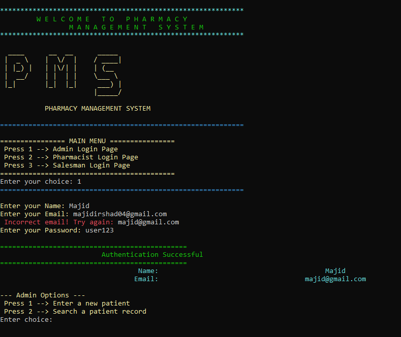  
👉 This is the entry page of the system. It provides 3 options:  
- 👨‍💻 **Admin Page**  
- 💊 **Pharmacist Page**  
- 🧑‍💼 **Salesman Page**  
Also includes **Admin login**.

---

## 👨‍⚕️ Admin Panel
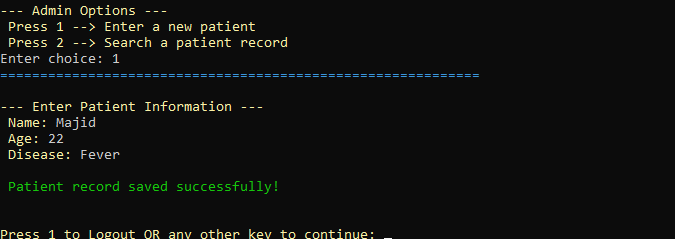  
👉 The Admin manages patients and overall system activities.  

Features:  
- ➕ **Add Patient** – Enter patient details like Name, Age, Disease  
- 🔍 **Search Patient** – Find patient records by name  
  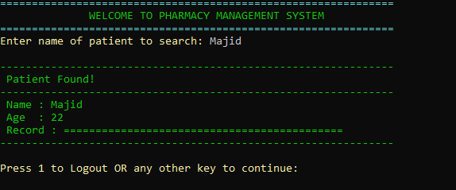  
- 🔑 **Reset Password** – Admin can reset password (changes are stored in file)  
  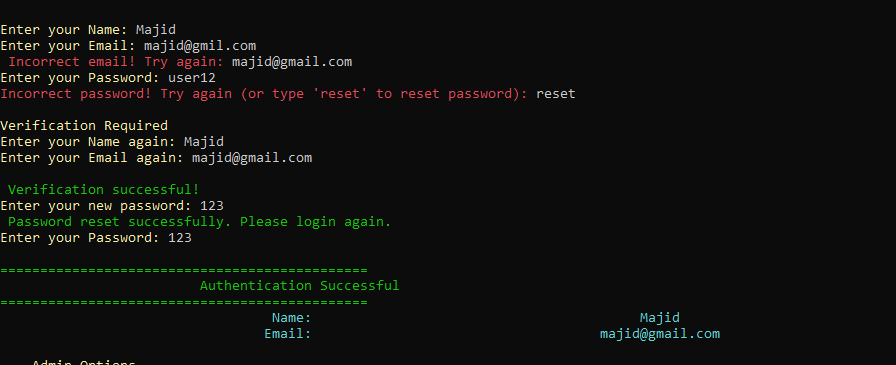  
- 🛑 **Wrong Entry Log** – Invalid actions are saved into a file for tracking  
  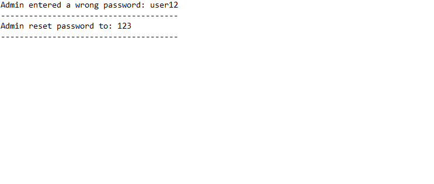  
- 📊 **Daily Work Report** – Track admin activities in one place  
    

---

## 💊 Pharmacist Panel
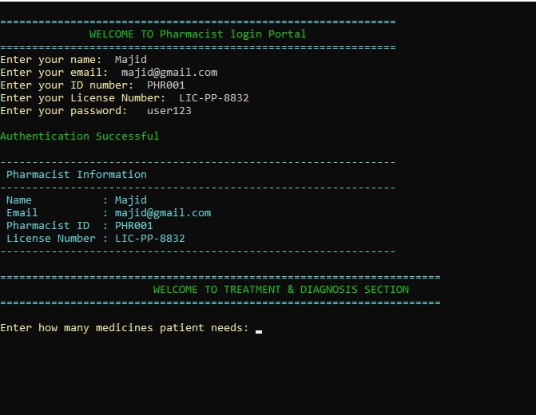  
👉 Pharmacist manages **medicine prescriptions for patients**.  

Features:  
- 🔑 **Login System** – Pharmacist must log in to access system  
- 💡 **Medicine Request** – Enter number of medicines required for patient  
- 📝 **Medicine Details** – Enter medicine names → System returns name + price  
  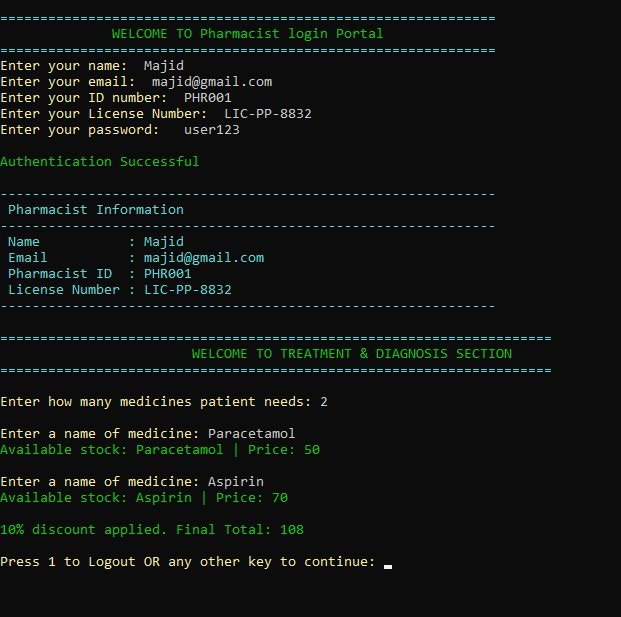  
- 💰 **Final Bill** – Automatic calculation of total cost  

---

## 🧑‍💼 Salesman Panel
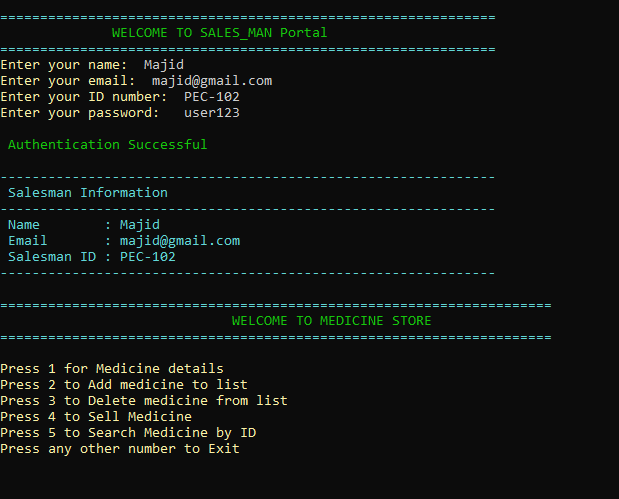  
👉 Salesman handles **medicine stock, sales, and billing**.  

Features:  
- ➕ **Add Medicine**  
- 📄 **View Medicine Details** – See expiry status & available stock  
    
- 🏷️ **Add Medicine Info** – Enter ID, Manufacturer, Category  
  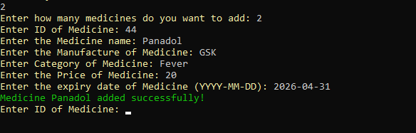  
- ⛔ **Expired Medicine Check** – System blocks expired medicines  
  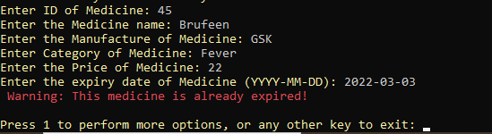  
- 📆 **Yearly Medicine Report** – Shows total medicines entered in a year  
  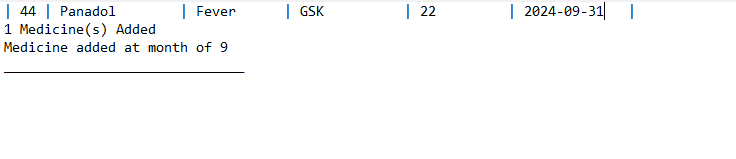  
- 📦 **Medicine Stock Update** – Valid medicines added to stock  
  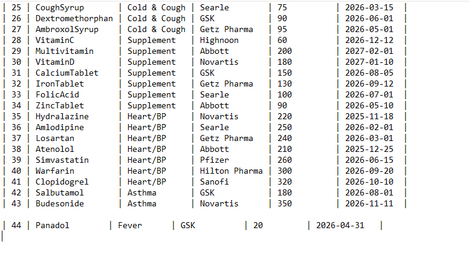  
- 🗑️ **Delete Medicine by ID** – Auto-updates stock after deletion  
  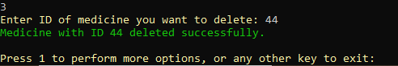  
    
- 🔎 **Search Medicine by ID**  
  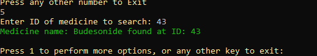  
- 💳 **Payment Process** – Handle payment for purchased medicines  
  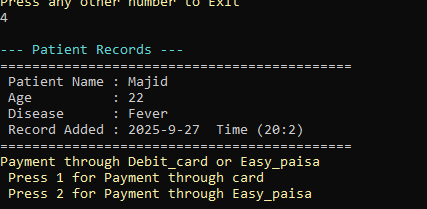  
- 🧾 **Invoice Generation** – Auto-generated after payment  
  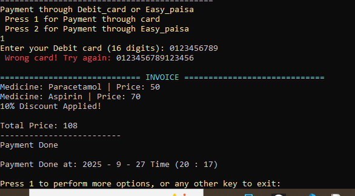  
- 🗂️ **Expired Medicines File** – Wrongly added expired medicines are stored in a separate file  
    
- 🖨️ **Printed Bill** – Bill is saved into a file for records  
  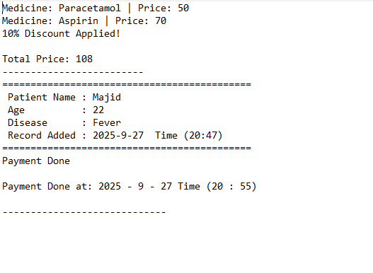  

---

## 🧑‍🤝‍🧑 Patient Management
👉 All patient data is managed securely within the system.  

- 📋 **All Patients Stored** – Maintain patient records in the database  
  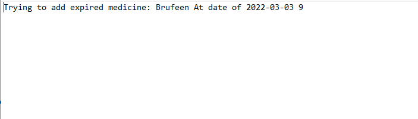  
- ⏰ **Timestamp** – Patient entry stored with exact time  
  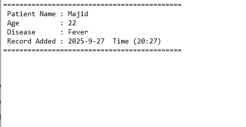  
- 🔒 **Validation** – If a patient is not registered, medicines cannot be issued  
  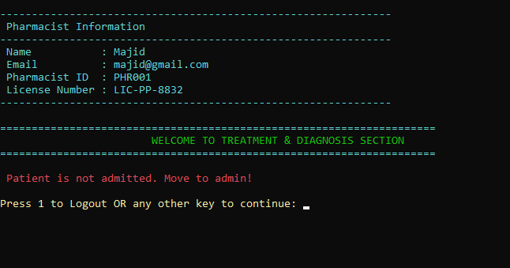  

---

## 📊 Reports
👉 The system generates reports for medicines, sales, and activities.  

- 📦 **Total Medicines Added**  
  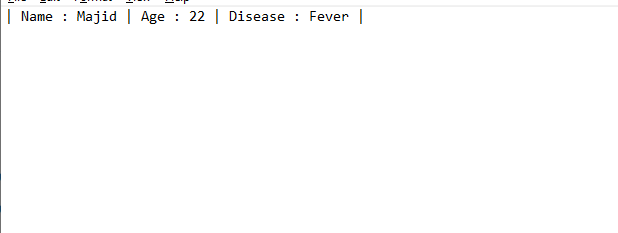  
- 💹 **Sales Report**  
  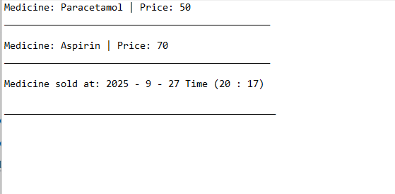  

---

## ⚙️ Technologies Used
- 🖥️ **Language:** C++  
- 📂 **Concepts:** File Handling, OOP, 

---

## Group 11
## 👨‍⚕️ Aurthor

- Abddul Majid Ali                   2024-SE-22
- Zulkarnain Mohid-Ud-Din            2024-SE-07
- Alishba Zakir                      2024-SE-02     

 
## Contributors
- [Majidali90121](https://github.com/Majidali90121) 🚀
- [CodeZulqarnain](https://github.com/CodeZulqarnain)💯
- [alishbazakir123](https://github.com/alishbazakir123) 🌟